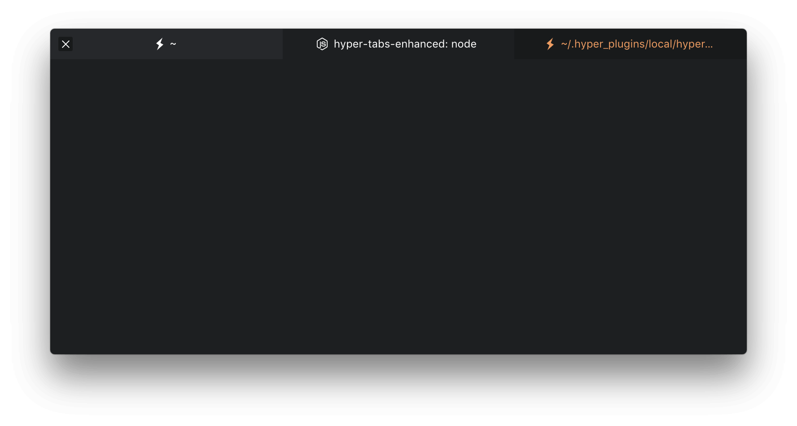

# hyper-tabs [](https://www.npmjs.com/package/hyper-tabs) [](https://www.npmjs.com/package/hyper-tabs)

> Tabs Plugin for [Hyper](https://hyper.is). Minimal tabs, dynamic tabs, tab icons & tab activity. Matches any theme.




## Install

Add following to your `~/.hyper.js` config.

```javascript
module.exports = {
  ...
  plugins: ['hyper-tabs']
  ...
}
```


## Config

Add following to `~/.hyper.js`.

### Enable Border
Default value is `false`

```javascript
module.exports = {
  config: {
    ...
      hyperTabs: {
        border: true,
      }
    ...
  }
}
```

### Change Activity Color
Expected value is `CSS colors`

```javascript
module.exports = {
  config: {
    ...
      hyperTabs: {
        activityColor: 'salmon',
      }
    ...
  }
}
```

### Disable Tab Icons
Default value is `true`

```javascript
module.exports = {
  config: {
    ...
      hyperTabs: {
        tabIcons: false,
      }
    ...
  }
}
```

### Disable Activity Pulse
Default value is `true`

```javascript
module.exports = {
  config: {
    ...
      hyperTabs: {
        activityPulse: false,
      }
    ...
  }
}
```


## Theme

* [hyper-hybrid-theme](https://github.com/alexfedoseev/hyper-hybrid-theme)


## License

MIT © Henrik
